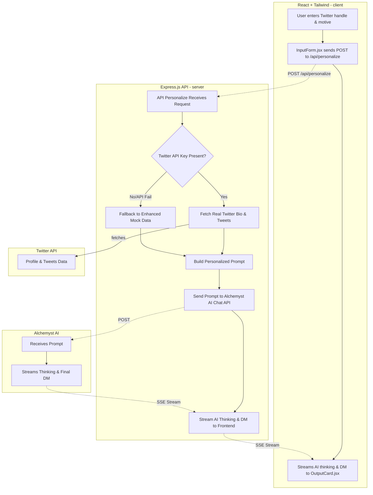

# Cold DM Personalizer

##DEMO VIDEO
(https://github.com/itsshresth/dmdom/blob/main/d90058b8-fdfa-4774-95d3-fec6727c3558.mp4)


Generate ultra-personalized cold DMs for Twitter users using real-time profile data and Alchemyst AI.

---

## Features

- Real Twitter API integration (with smart fallback to enhanced mock data)
- AI-powered DM generation using Alchemyst AI
- Real-time AI "thinking" streaming (Server-Sent Events)
- Character count for Twitter's 280-char limit
- One-click copy to clipboard


---

## Tech Stack

- **Frontend:** React.js, Tailwind CSS, Axios
- **Backend:** Node.js, Express.js, Server-Sent Events
- **AI:** Alchemyst AI Chat API
- **Data:** Twitter API v2 (with fallback)

---

## Quick Start

### Prerequisites

- Node.js (v16+)
- Alchemyst AI API key
- Twitter Bearer Token (optional, for real data)

### Installation

1. **Clone the repository**
    ```
    git clone https://github.com/yourusername/cold-dm-personalizer.git
    cd cold-dm-personalizer
    ```

2. **Install backend dependencies**
    ```
    cd server
    npm install
    ```

3. **Install frontend dependencies**
    ```
    cd ../client
    npm install
    ```

4. **Set up environment variables**
    ```
    # Copy example files
    cp server/.env.example server/.env
    cp client/.env.example client/.env

    # Edit server/.env with your actual API keys
    ```

5. **Start the development servers**
    ```
    # Terminal 1 - Backend
    cd server
    npm start

    # Terminal 2 - Frontend
    cd client
    npm start
    ```

6. **Open your browser**
    - Visit [http://localhost:3000](http://localhost:3000)

---

## Environment Variables

### Backend (`server/.env`)
- `ALCHEMYST_API_KEY`: Your Alchemyst AI API key (required)
- `TWITTER_BEARER_TOKEN`: Twitter API Bearer Token (optional)
- `PORT`: Server port (default: 5000)

### Frontend (`client/.env`)
- `REACT_APP_API_URL`: Backend API URL (default: http://localhost:5000)

---

## API Keys Setup

### Alchemyst AI
1. Sign up at [Alchemyst AI](https://getalchemystai.com)
2. Get your API key from the dashboard
3. Add it to `server/.env`

### Twitter API (optional)
1. Apply for developer access at [developer.twitter.com](https://developer.twitter.com)
2. Create a new app and generate Bearer Token
3. Add it to `server/.env`

*If no Twitter API key is provided, the app uses enhanced mock data.*

---

## Deployment

### Backend (Railway/Render/Vercel)
- Add your environment variables in the platform dashboard.
- Set build/start commands (`npm install`, `node index.js`).

### Frontend (Vercel/Netlify)
- Set `REACT_APP_API_URL` to your deployed backend URL in environment settings.
- Build command: `npm run build`
- Output directory: `build`

---

## Architecture

## License

This project is licensed under the MIT License.

---

## Acknowledgments

- [Alchemyst AI](https://getalchemystai.com)
- [Twitter API](https://developer.twitter.com)
- Built with ❤️ for better networking

---

**⭐ If this project helped you, please give it a star!**
